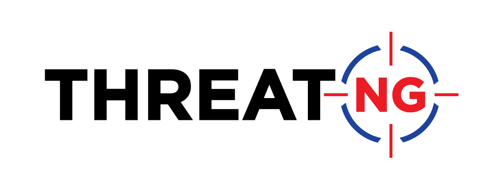

<div align="center">  

<p align="center">
ThreatNG is redefining external attack surface management (EASM), digital risk protection, and security ratings with a platform of unmatched breadth, depth, and capabilities in managing technical and business threats across the dark, deep, and open web. Living up to the company mantra (“Security Centric; Not Exclusive”), ThreatNG provides a configurable solution to target, discover, and assess digital assets across a definable ecosystem of organizations, subsidiaries, partners, third parties, supply chain, and customers. Bolstered and maintained by the open source intelligence (OSINT) experts at DarcSight Labs, ThreatNG empowers organizations of all types and sizes to uncover, understand, and manage their external digital threats. 

</p>

--- 


<p align='center'>

Connect with us on Social Media! 

 <a href="https://www.threatngsecurity.com/">
   
  </a>&nbsp;&nbsp;
  <a href="https://www.linkedin.com/company/threatngsecurity/">
    
  </a>&nbsp;&nbsp;
  <a href="https://www.instagram.com/threatngsecurity/">
            
  </a>&nbsp;&nbsp;
    <a href="https://twitter.com/threatngsec">
            
  </a>&nbsp;&nbsp;
      <a href="https://www.facebook.com/threatng">
            
  </a>&nbsp;&nbsp;
        <a href="http://youtube.com/@threatngsecurity">
            
  </a>&nbsp;&nbsp;
  <br><br>
    </a>
        <a href="https://creativecommons.org/licenses/by-sa/4.0/">
            
  </a>
</p>


</div>  


# ThreatNG Security Open Source Repositories

> These repositories contain data that has been open-sourced by [ThreatNG Security](https://threatngsecurity.com).  
> The data contained in these repositories can be used by anyone in any capacity with proper attribution.

### Attribution & Citation  
```
* Data aggregated, provided, and maintained by ThreatNG Security.
```  

---  

<br>

# Why?

At ThreatNG, we built a product around open source intelligence (OSINT), which compromises technical and non-technical aspects, something that separates us from others in our competitive landscape. As we continue building new, innovative solutions to modern-day risks and threats, we decided that some of our plans were better shared with the broader community to help drive even more security, privacy, and risk innovation.
 <br>

### **Interested in how we integrate this data automatically into our External Attack Surface Management (EASM), Digital Risk Protection (DRP), and Security Risk Rating platform at ThreatNG?**  

### [**Reach out today for a free evaluation!**](https://www.threatngsecurity.com/evaluate)


<br>


# Repositories and Descriptions

<br>

| Repository | Description |
| ------------------ | ---------------------------------------- |
| ESG Filings | ESG (Environmental, Social, Governance) is an emerging industry becoming increasingly popular in risk management. This repository contains the links to each listed organization's ESG (Sustainability or CSR [Corporate Social Resposiblity] filings and information). |
| ESG Violations | ESG (Environmental, Social, Governance) is an emerging industry becoming increasingly popular in risk management, and with its popularity comes violations and fines in each of these areas. This repository contains links to sources that provide ESG-related violations and fines. |
| Ethics & Governance | Organizations are often asked how their business is run and governed, and being transparent about these practices can become a competitive advantage. This repository contains links to each listed organization's Ethics and Governance information. |

<br>

# Coming Soon!  

<br>


| Repository | Description |
| ------------------ | ---------------------------------------- |
| Compliance & Trust | Organizations' transparency about their security and compliance practices has become pivotal in third-party risk management (TPRM). This repository contains the links to each listed organization's Security & Compliance information. |
| Privacy Policies | The privacy policy is often disregarded and not read as it contains heavy legal language and is overly complex. Still, it is a great starting point for understanding what data an organization gathers, how they use it, and how they share and protect it. This repository contains the links to each listed organization's privacy policy. | 
| Terms of Service | The terms of service or use is another often disregarded document, as it also uses heavy legal language. It is a great starting point for understanding what an organization expects from the users of its provided service. This repository contains the links to each listed organization's Terms of Use Policy. | 
| Career/Jobs Page | Organizations are always looking for new talent, and their job roles and descriptions can often reveal technologies used or other events taking place at the organization. This repository contains the links to each listed organization's Jobs or Career Page. | 

<br>

# Contributing

<br>

## How to Contribute?
Thank you for your interest in contributing to this repository!

To contribute to this repository, please create a pull request with any updates or additions.  
*These will be reviewed and merged on a bi-weekly basis.*


<br>

# Contributors 
Thanks to all our contributors!  
<table>
  <tbody>
    <tr>
    </tr>
   <tbody>
<table>
